# Deployment
The application consists of a single [Spring Boot](https://spring.io/projects/spring-boot) application running on Java 25 LTS and [PReact](https://preactjs.com/) frontend, which is served directly by the Java application.
Deployment is realized using Docker and Docker Compose.

```mermaid
architecture-beta
    group docker(cloud)[Docker]
    group ontopus(server)[OntoPuS container] in docker

    service java(server)[Java application] in ontopus
    service preact(server)[Preact application] in ontopus
    service files(disk)[Ontopus persistent data volume] in docker

    service db(database)[GraphDB container] in docker

    service user(none)[user]

    java:R -- L:preact
    java:L -- R:db
    java:B -- R:files

    user:R -- T:java
```



## Prerequisites
- Subdomain dedicated for the OntoPuS instance (e.g. ontopus.example.com)
  - The subdomain hosts the administration frontend, administration API and some public endpoints (e.g. Widoco generated HTML documentation for the ontologies).
  - The subdomain **CAN NOT** be replaced with a path (e.g. example.com/ontopus is not allowed), subdomain is required and must not contain a base path (e.g. ontopus.example.com/base/path is not allowed)
- [Optional] Existing [GraphDB](https://graphdb.ontotext.com/) server
- [Optional] Existing reverse proxy server (e.g. Nginx, Apache) for SSL termination and routing

## Docker compose

To use a prebuild image, use the [docker/docker-compose.yaml](./docker/docker-compose.yaml) example.
See the [configuration documentation](./CONFIGURATION.md) for more details on the available configuration options.


1. Edit the docker compose file
- If you already have a GraphDB server, add external docker network to the compose, if needed, and connect the OntoPuS container to it. Don't forget to change the database URL (`ONTOPUS_DATABASE_URL`).
- If you don't have an existing GraphDB server, uncomment the ports in the compose file for GraphDB to access the configuration interface later.

- If you already have a reverse proxy server, you can remove the nginx container, you can check example configuration for Nginx in [docker/nginx](./docker/nginx) directory.
  - You need to configure the subdomain for OntoPuS and all the domains of your ontologies to point to the OntoPuS instance.

- If you want to use the nginx proxy in the example docker file, you will need the whole [docker/nginx](./docker/nginx) directory alongside the docker compose file.

2. Build the stack and start the containers
```bash
docker compose up -d
```

3. Configure GraphDB server
- Access the interface of the GraphDB server (e.g. http://localhost:7200)
- Create a new repository with the same name as in the configured database URL (default repository name: `ontopus`)
- Repository parameters:
```
GraphDB repository
Repository ID: ontopus
Ruleset: No inference
Enable context index: true
Enable SHACL validation: true
```

4. Edit the docker compose file to remove the exposed ports for GraphDB
5. Restart the stack
```bash
docker compose down
docker compose up -d
```
6. Check OntoPuS logs, a new admin user should be created
```
No user account found. Generated new account: admin, password: <password>
Make sure to change the password after the first login!
```
Currently, the server does not have a user management implemented, to change the password or add a new user, see [instructions below](#changing-the-user-account-password).

7. Access the administration interface at the system URI (e.g. http://ontopus.example.com/admin) and log in with the created user

## Changing the user account password
The password value uses bcrypt hash.
The hash can be generated for example with [CyberChef](https://cyberchef.org/#recipe=Bcrypt(10)&input=YWJlY2VkYQ).

Replace the `<bcrypt_hash>` in the following query to change the password of the default admin account.
```sparql
PREFIX ontopus: <http://ontology.lukaskabc.cz/application/ontopus/>
PREFIX ontopus_user: <http://ontology.lukaskabc.cz/application/ontopus/UserAccount/>
DELETE {
    ontopus_user:admin ontopus:password ?oldValue .
}
INSERT {
    GRAPH ontopus:UserAccount {
        ontopus_user:admin ontopus:password "<bcrypt_hash>" .
    }
}
WHERE {
    GRAPH ontopus:UserAccount {
        ontopus_user:admin ontopus:password ?oldValue .
    }
}
```

To add a new user:
(update the identifier, username and password hash)
`<http://ontology.lukaskabc.cz/application/ontopus/UserAccount/USERNAME>`
```sparql
INSERT DATA {
  GRAPH <http://ontology.lukaskabc.cz/application/ontopus/UserAccount> {
    <http://ontology.lukaskabc.cz/application/ontopus/UserAccount/USERNAME> a <http://ontology.lukaskabc.cz/application/ontopus/UserAccount> ;
      <http://ontology.lukaskabc.cz/application/ontopus/password> "<brypt_hash>" ;
      <http://rdfs.org/sioc/ns#name> "<USERNAME>" .
  }
}
```

This is a temporary solution until user management is properly implemented.
