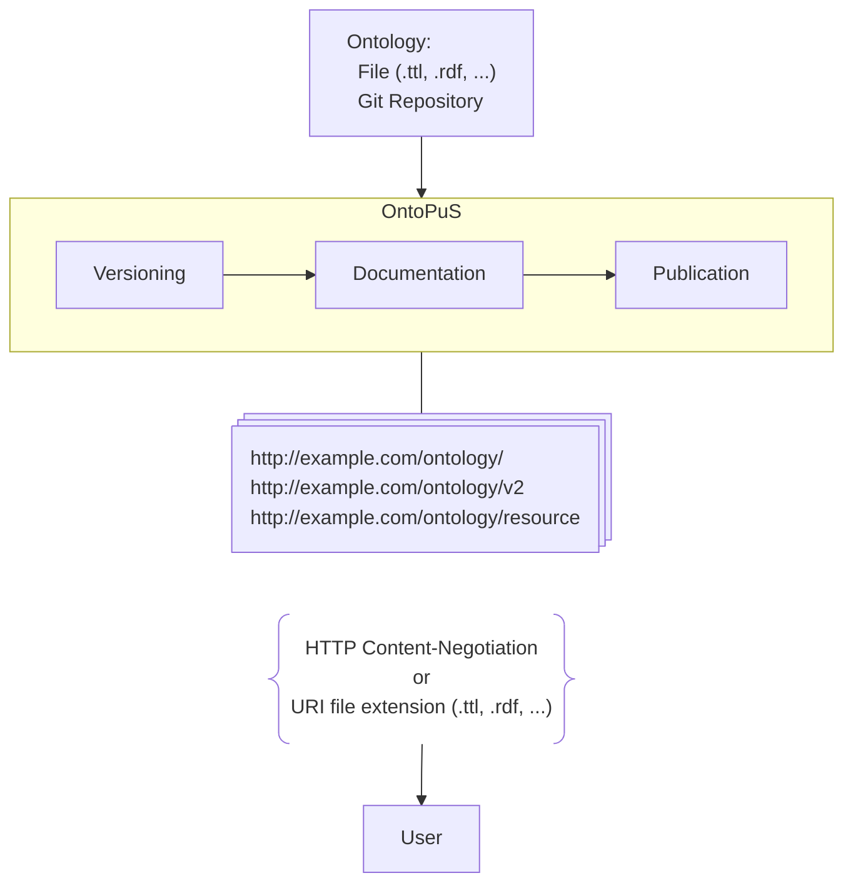

    </img>

<h1 align="center">OntoPuS Ontology Publication Server</h1>

OntoPuS allows publication of ontologies with **versioning** support.  
**The main features include:**
- Publication from different sources (file upload, git repository)
- Versioning
- Generating HTML documentation
- Support for autonomous publications of new versions
- Serving the ontology at its URI
- Serving individual resources at their URIs
- Plugin support

    
Administration interface for uploading ontology from a file

    

        
    

The server uses a **plugin architecture**, allowing customization, replacement, or addition of new steps to the publication pipeline, as well as integration with **external systems**.

OntoPuS is written in **Java** on top of **Spring Boot** and deployed with **Docker**.  
**For deployment instructions, please refer to [deployment guide](./DEPLOYMENT.md).**

## Accessing published ontologies
Each version of the ontology is accessible at the respective version URI, while the latest version is also accessible at the ontology URI.
Furthermore, each resource in the ontology is accessible via its URI.

For example, ontology used internally in OntoPuS is saved in the [ontopus.ttl](core-model/ontology/ontopus.ttl) file.
The domain `ontology.lukaskabc.cz` is pointing to an instance that also publishes the OntoPuS ontology.

The latest version of the ontology is available with standard [HTTP content-negotiation](https://developer.mozilla.org/en-US/docs/Web/HTTP/Guides/Content_negotiation) support at the ontology URI:  
[`https://ontology.lukaskabc.cz/application/ontopus`](https://ontology.lukaskabc.cz/application/ontopus)  
Aside from the content-negotiation, a specific format can also be obtained with a file extension in the URI:  
[`https://ontology.lukaskabc.cz/application/ontopus.ttl`](https://ontology.lukaskabc.cz/application/ontopus.ttl)  
Using unavailable format shows the mutliple choice of available formats for the requested URI:  
[`https://ontology.lukaskabc.cz/application/ontopus.jpeg`](https://ontology.lukaskabc.cz/application/ontopus.jpeg)

Each resource from the ontology is available at its respective URI:  
[`https://ontology.lukaskabc.cz/application/ontopus/OntopusCatalog`](https://ontology.lukaskabc.cz/application/ontopus/OntopusCatalog)  
[`https://ontology.lukaskabc.cz/application/ontopus/OntopusCatalog.ttl`](https://ontology.lukaskabc.cz/application/ontopus/OntopusCatalog.ttl)  
Only the latest versions of individual resources are available.

A specific version of the ontology is available at its version URI:  
[`https://ontology.lukaskabc.cz/application/ontopus/1.0-dev`](https://ontology.lukaskabc.cz/application/ontopus/1.0-dev)  
[`https://ontology.lukaskabc.cz/application/ontopus/1.0-dev.ttl`](https://ontology.lukaskabc.cz/application/ontopus/1.0-dev.ttl)

## Publication pipeline
OntoPuS publishes an ontology using the following steps:
1. The ontology is loaded from its source  
Currently, only file uploads from the administration or a git repository are supported.
2. The ontology document is imported into the database
3. A version is assigned to the ontology  
The server can extract the version and version IRI directly from the annotations of the ontology,  
generate a new version automatically (for example, use the release date)  
or not version the ontology (in that case, only a single "latest" version exists and gets rewritten on each release).
5. HTML documentation is generated using [WIDOCO](github.com/dgarijo/Widoco)

